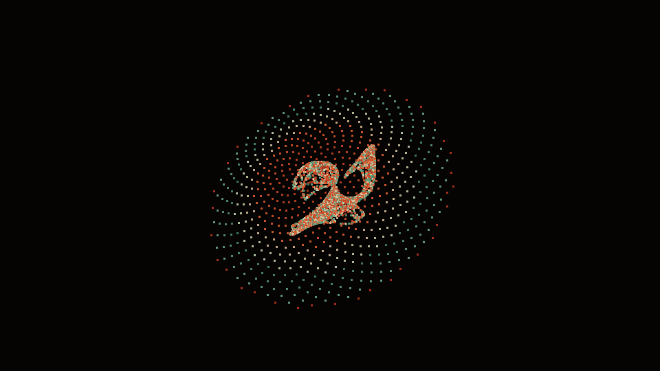
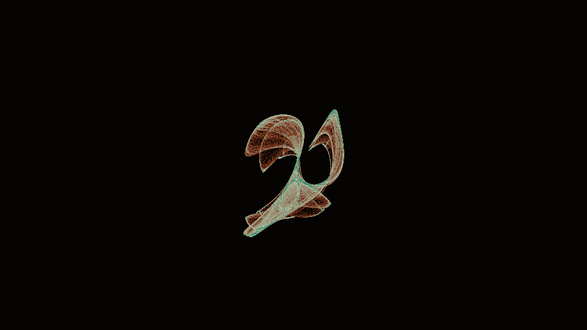
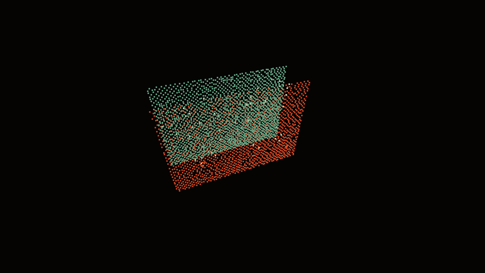
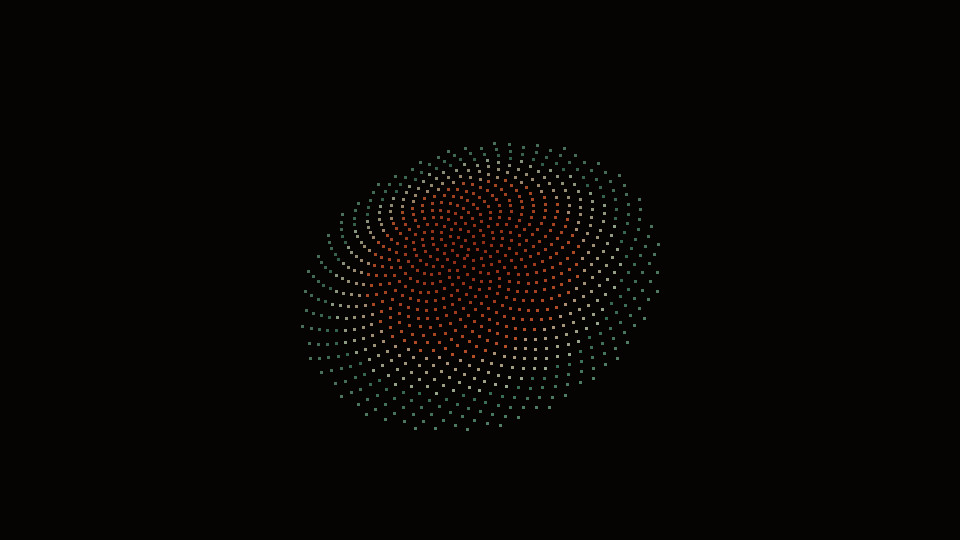
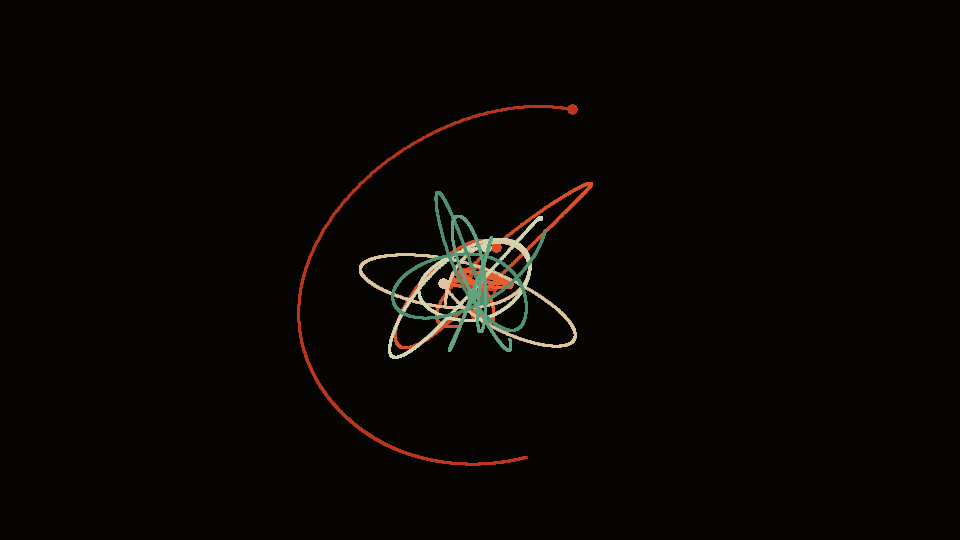
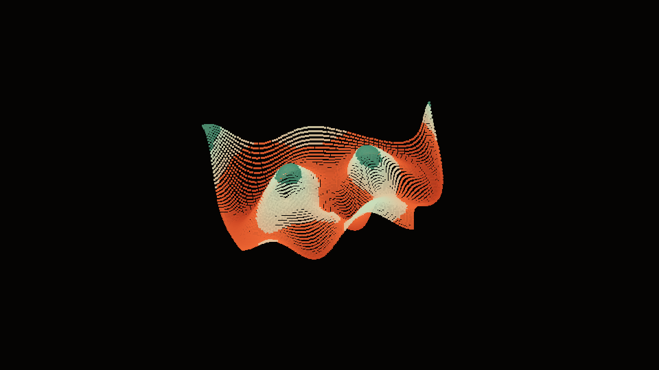
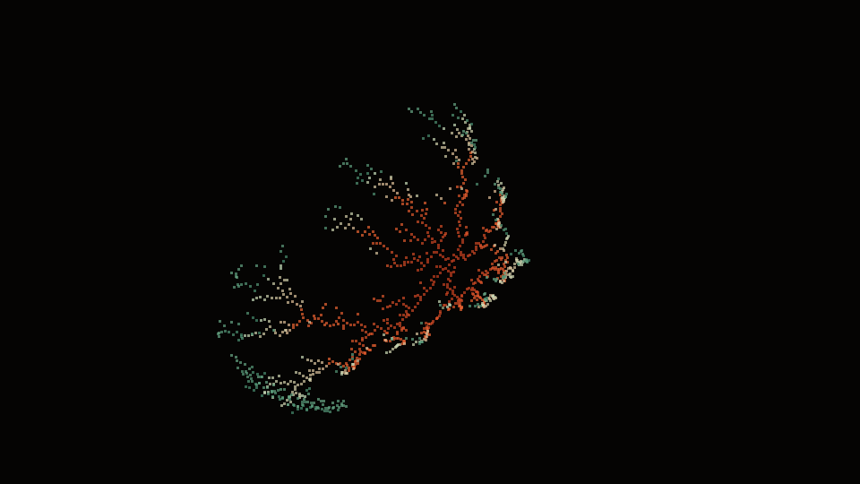

# AbraKadaVra💀

**A digital grimoire of algorithm-generated beauty.**

<p align="center">
  
</p>

Speak the name. The universe does not clap for parlor tricks — it answers with the laws it was already running in the dark: chaos that never repeats, chemicals that invent their own skin, irrational angles that pack a sunflower, gravity that writes ellipses in smoke, waves that cancel into lace, and random walks that grow into bone.

This is **AbraKadaVra💀** — not a fractal museum of Mandelbrot cousins, not a demoscene clone. Six spells. Six different principles. One ritual mask over real mathematics.

**Languages on the site:** `EN` · `РУ` · `中文` (switcher at the bottom of the first screen).

---

## Live grimoire

**Site:** https://hyperlinksspace.github.io/AbraKadaVra/

Gallery previews and full spells are **living 3D fragments**: drag to orbit, hover to tilt, scroll to zoom. On-canvas hint pills and a legend under each stage spell out the gestures.

## Showcase

| Chaos Sigil | Turing Skin |
|:-:|:-:|
|  |  |
| Strange attractors | Reaction–diffusion morphogenesis |

| Phyllotaxis Bone | Orbital Hex |
|:-:|:-:|
|  |  |
| Golden-angle packing | Newtonian N-body dance |

| Interference Veil | Bone Growth |
|:-:|:-:|
|  |  |
| Wave superposition | Diffusion-limited aggregation |

| Spell | Principle | What you’re seeing |
| --- | --- | --- |
| **Chaos Sigil** | Sensitive dependence | Clifford / De Jong / Lorenz / Aizawa attractors — infinite ink from a few coupled equations |
| **Turing Skin** | Morphogenesis | Gray–Scott reaction–diffusion — how spots and stripes invent themselves |
| **Phyllotaxis Bone** | Golden angle packing | Vogel spirals — the irrational turn plants use so nothing wastes space |
| **Orbital Hex** | Gravitation | Softened N-body Newtonian dance — orbits, slingshots, temporary galaxies |
| **Interference Veil** | Superposition | Multi-source wave interference — crest + crest, crest + trough |
| **Bone Growth** | Aggregation | Witten–Sander DLA — lightning, coral, frost from sticky chance |

---

## Why this exists

Beauty in nature is rarely decoration. It is **constraint wearing jewelry**.

- Chaos looks ornate because trajectories cannot settle without forgetting where they started.
- Animal coats look painted because two diffusivities disagree.
- Seed heads look sacred because √2 and φ refuse to close a circle.
- Lightning looks intentional because a random walk freezes on contact.

AbraKadaVra💀 is a small altar to that idea: **interesting properties of the universe, rendered as spells you can touch.**

---

## Run locally

Any static server from the repo root:

```bash
# Python
python -m http.server 8080

# Node
npx serve .
```

Then open `http://localhost:8080`.

Modules are ES modules — `file://` may block them in some browsers; use a local server.

Regenerate README showcase images:

```bash
python scripts/gen_readme_images.py
```

---

## Structure

```
index.html          # landing grimoire (+ EN / РУ / 中文)
css/grimoire.css    # shared ritual theme
js/                 # hero, previews, i18n, utilities
spells/             # six interactive canvases
assets/img/         # README showcase frames
```

GitHub Pages: serve from the repository root. No build step.

---

## Inspiration (and deliberate difference)

Curious neighbors on the shelf:

- [nxrix/hypercomplex](https://github.com/nxrix/hypercomplex) — Latin-square 4D hypercomplex fractals
- [nxrix/xyzine](https://github.com/nxrix/xyzine) — Picotron-inspired generative play

AbraKadaVra💀 borrows the *spirit* (generative, explorable, mathematically honest) and refuses the *methods*. No Latin-square algebras. No xyzine remake. Other engines, other ghosts.

---

## License

MIT. Remix the spells. Rename the demons. Keep the skull if you must.

**AbraKadaVra💀** — algorithms wearing a ritual mask.
